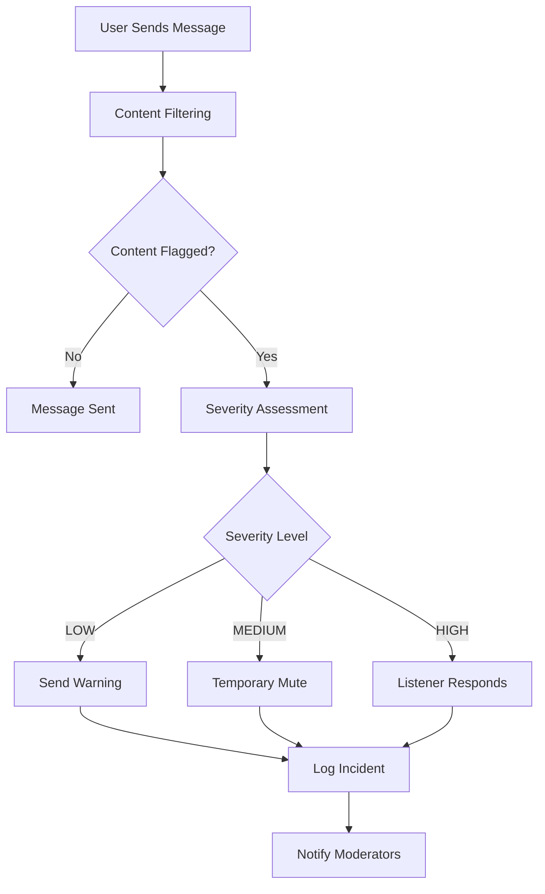

# Groups and Moderation System

## Overview

The Groups and Moderation system provides Discord-style peer groups with AI-assisted content filtering, automatic moderation, and role-based access control. This system ensures safe, inclusive group environments while maintaining user privacy through anonymous naming.

## Features

### 🏠 **Discord-Style Groups**
- Topic-specific peer groups
- Anonymous user names for privacy
- Voice and text communication
- Group locking by admins/leads

### 🛡️ **AI-Assisted Moderation**
- Automatic content flagging
- Real-time harmful content detection
- Configurable moderation actions
- Severity-based response system

### 👥 **Role-Based Access Control**
- **ADMIN**: Full group management, can always send messages
- **LISTENER**: Group leads, can always send messages
- **MEMBER**: Regular users, restricted when group is locked

## Content Moderation System

### How It Works

The moderation system uses a **multi-layered approach** to detect and handle harmful content:

1. **Keyword Detection**: Scans messages for harmful terms
2. **Severity Assessment**: Assigns risk levels (LOW, MEDIUM, HIGH)
3. **Automatic Actions**: Applies appropriate moderation based on severity
4. **Listener Response**: High-severity content triggers direct listener engagement
5. **Human Review**: Flags content for moderator attention

### Smart Moderation System

The system uses **intelligent content analysis** to determine the appropriate response:

#### **Immediate Ban (Scams & Illicit Marketing)**
- **Automatic detection** of scam keywords
- **Immediate ban** for financial fraud, illegal activities
- **No human review** needed for clear violations
- **Protects users** from financial harm

#### **Listener Response (Support & Guidance)**
- **High-severity content** triggers listener notification
- **Listeners engage directly** with users in distress
- **Provide support** and resources
- **Assess the situation** with human judgment
- **Escalate** to emergency services if needed
- **Document** their response for follow-up

### Content Filtering Categories

#### 🚨 **High Severity (Immediate Action)**
- **Violence & Harm**: `violence`, `hate`, `harassment`, `bullying`
- **Self-Harm**: `suicide`, `self-harm`, `self-injury`
- **Illegal Activities**: `drugs`, `illegal`, `scam`, `fraud`

#### ⚠️ **Medium Severity (Warning/Mute)**
- **Inappropriate Content**: `inappropriate`, `offensive`, `spam`
- **Harassment**: `harassment`, `bullying`, `intimidation`
- **Misinformation**: `fake`, `hoax`, `conspiracy`

#### 💡 **Low Severity (Monitor)**
- **Questionable Content**: `suspicious`, `concerning`, `borderline`
- **Minor Violations**: `spam`, `repetitive`, `off-topic`

### Moderation Actions

| Severity | Action | Duration | Description |
|-----------|--------|----------|-------------|
| **LOW** | WARN | - | User receives warning notification |
| **MEDIUM** | MUTE | 15-60 min | User temporarily cannot send messages |
| **HIGH** | LISTENER_RESPONSE | - | Listener responds directly to user |
| **HIGH** | BAN | Permanent | User banned for scams/illicit marketing |
| **CRITICAL** | LOCK_GROUP | Until review | Group locked for moderator review |

### Example Content Detection

```typescript
// Message: "I'm feeling really down and thinking about ending it all"
// Detected Keywords: ['suicide', 'self-harm']
// Severity: HIGH
// Action: LISTENER_RESPONSE
// Reason: Multiple self-harm indicators - listener will respond directly

// Message: "This is so annoying, I hate everyone here"
// Detected Keywords: ['hate', 'harassment']
// Severity: MEDIUM
// Action: MUTE (30 minutes)
// Reason: Hostile language

// Message: "Check out this amazing deal, only $99!"
// Detected Keywords: ['scam']
// Severity: HIGH
// Action: BAN
// Reason: Potential scam/fraud - user banned immediately
```

## Implementation Details

### Content Filtering Algorithm

```typescript
async filterContent(content: string, type: 'MESSAGE' | 'VOICE_TRANSCRIPT'): Promise<ContentFilterDto> {
  // 1. Normalize content
  const normalizedContent = content.toLowerCase().trim();
  
  // 2. Check against harmful keywords
  const flaggedTerms = harmfulKeywords.filter(keyword => 
    normalizedContent.includes(keyword.toLowerCase())
  );
  
  // 3. Assess severity based on keyword count and context
  let severity: 'LOW' | 'MEDIUM' | 'HIGH' = 'LOW';
  let suggestedAction: ModerationAction = 'NONE';
  
     if (flaggedTerms.length >= 3) {
     severity = 'HIGH';
     suggestedAction = 'LISTENER_RESPONSE';
   } else if (flaggedTerms.length >= 2) {
    severity = 'MEDIUM';
    suggestedAction = 'MUTE';
  } else if (flaggedTerms.length >= 1) {
    severity = 'LOW';
    suggestedAction = 'WARN';
  }
  
  // 4. Return assessment with confidence score
  return {
    content,
    type,
    severity,
    flaggedTerms,
    suggestedAction,
    confidence: flaggedTerms.length > 0 ? 0.8 : 0.95,
  };
}
```

### Moderation Workflow



## Configuration

### Harmful Keywords List

The system maintains a configurable list of harmful keywords organized by category:

```typescript
const harmfulKeywords = {
  violence: ['violence', 'attack', 'fight', 'kill', 'murder'],
  selfHarm: ['suicide', 'self-harm', 'self-injury', 'end-it-all'],
  harassment: ['hate', 'harassment', 'bullying', 'intimidation'],
  illegal: ['drugs', 'illegal', 'scam', 'fraud', 'theft'],
  inappropriate: ['inappropriate', 'offensive', 'spam', 'nude'],
  misinformation: ['fake', 'hoax', 'conspiracy', 'lies']
};
```

### Moderation Settings

```typescript
interface ModerationConfig {
  // Automatic actions
  autoWarn: boolean;           // Send warnings automatically
  autoMute: boolean;           // Mute users automatically
  autoBan: boolean;            // Ban users automatically
  
  // Duration settings
  muteDuration: number;        // Default mute duration (minutes)
  warningThreshold: number;    // Warnings before auto-mute
  
  // Sensitivity
  sensitivityLevel: 'LOW' | 'MEDIUM' | 'HIGH';
  
  // Review requirements
  requireHumanReview: boolean; // Flag content for human review
}
```

## API Endpoints

### Group Management
- `POST /groups` - Create new group
- `POST /groups/:id/join` - Join group
- `GET /groups/:id` - Get group details

### Messaging
- `POST /groups/:id/messages` - Send message (with auto-moderation)
- `GET /groups/:id/messages` - Get group messages
- `GET /groups/:id/can-send-message` - Check message permissions

### Moderation
- `POST /groups/:id/moderate` - Apply moderation action
- `GET /groups/:id/moderation-log` - View moderation history
- `PUT /groups/:id/lock` - Lock/unlock group

## Best Practices

### For Group Admins & Listeners
1. **Monitor Content**: Regularly review flagged content
2. **Respond to High-Severity**: Directly engage with users in distress
3. **Set Clear Rules**: Establish group guidelines
4. **Use Locking**: Temporarily lock groups during sensitive discussions
5. **Provide Support**: Offer guidance and resources to flagged users

### For Users
1. **Respect Guidelines**: Follow group rules and community standards
2. **Report Issues**: Flag concerning content for moderator review
3. **Use Anonymous Names**: Protect privacy when needed
4. **Stay On-Topic**: Keep discussions relevant to group purpose

### For Developers
1. **Extend Keywords**: Add domain-specific harmful terms
2. **Customize Actions**: Adjust moderation responses
3. **Monitor Performance**: Track false positive rates
4. **Update Regularly**: Keep keyword lists current

## Future Enhancements

### AI Integration
- **Natural Language Processing**: Better context understanding
- **Sentiment Analysis**: Detect emotional distress
- **Pattern Recognition**: Identify coordinated harmful behavior
- **Learning System**: Improve accuracy over time

### Advanced Moderation
- **Image Analysis**: Detect inappropriate images
- **Voice Recognition**: Moderate voice conversations
- **Behavioral Analysis**: Track user patterns
- **Community Reporting**: Crowdsourced content flagging

### Customization
- **Group-Specific Rules**: Custom moderation per group
- **User Preferences**: Personalized content filtering
- **Moderation Levels**: Adjustable sensitivity settings
- **Appeal System**: User-friendly moderation appeals

## Security Considerations

### Privacy Protection
- **Anonymous Names**: Users can use pseudonyms
- **Data Minimization**: Only store necessary moderation data
- **Encryption**: Secure message transmission
- **Access Control**: Limited moderator permissions

### Abuse Prevention
- **Rate Limiting**: Prevent spam and abuse
- **Account Verification**: Reduce fake accounts
- **Moderator Oversight**: Human review of automated actions
- **Appeal Process**: Fair review of moderation decisions

## Troubleshooting

### Common Issues

**False Positives**
- Adjust keyword sensitivity
- Add context-aware filtering
- Review and update keyword lists

**Moderation Bypass**
- Implement additional detection layers
- Use behavioral analysis
- Regular keyword list updates

**Performance Issues**
- Optimize filtering algorithms
- Implement caching
- Use async processing

### Support

For technical support or feature requests:
- Create an issue in the project repository
- Contact the development team
- Review the API documentation
- Check the troubleshooting guide

---

*This system is designed to create safe, inclusive group environments while maintaining user privacy and freedom of expression. Regular updates and community feedback help improve moderation accuracy and effectiveness.*
